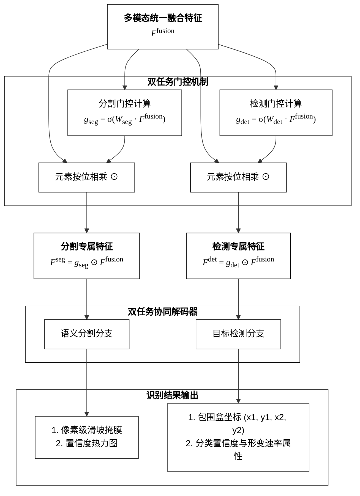

```mermaid
graph TD
    %% 样式定义：节点统一为白底、黑框、黑字
    classDef input fill:#FFFFFF,stroke:#000000,stroke-width:1px,color:#000000;
    classDef gate fill:#FFFFFF,stroke:#000000,stroke-width:1px,color:#000000;
    classDef feat fill:#FFFFFF,stroke:#000000,stroke-width:1px,color:#000000;
    classDef decode fill:#FFFFFF,stroke:#000000,stroke-width:1px,color:#000000;
    classDef output fill:#FFFFFF,stroke:#000000,stroke-width:1px,color:#000000;

    %% 子图样式定义（已完全消除黑块）
    style Gate_Module fill:#FFFFFF,stroke:#000000,stroke-width:1px,color:#000000;
    style Decoder_Module fill:#FFFFFF,stroke:#000000,stroke-width:1px,color:#000000;
    style Output_Module fill:#FFFFFF,stroke:#000000,stroke-width:1px,color:#000000;

    %% 1. 输入层（对 F_fusion 进行了学术公式字体美化）
    F_fusion["<b>多模态统一融合特征</b><br/><span style='font-family:Times New Roman, serif;'><i>F</i><sup>fusion</sup> </span>"]:::input

    %% 2. 门控机制层
    subgraph Gate_Module ["<b>双任务门控机制</b>"]
        direction TB
        G_seg["分割门控计算<br/><span style='font-family:Times New Roman, serif;'><i>g</i><sub>seg</sub> = σ(<i>W</i><sub>seg</sub> · <i>F</i><sup>fusion</sup>)</span>"]:::gate
        G_det["检测门控计算<br/><span style='font-family:Times New Roman, serif;'><i>g</i><sub>det</sub> = σ(<i>W</i><sub>det</sub> · <i>F</i><sup>fusion</sup>)</span>"]:::gate
        
        M_seg["元素按位相乘 ⊙"]:::gate
        M_det["元素按位相乘 ⊙"]:::gate
    end

    F_fusion --> G_seg
    F_fusion --> G_det
    F_fusion --> M_seg
    F_fusion --> M_det

    %% 消除连线文本背景黑块
    G_seg  --> M_seg
    G_det  --> M_det

    %% 3. 专属特征层
    M_seg --> F_seg["<b>分割专属特征</b><br/><span style='font-family:Times New Roman, serif;'><i>F</i><sup>seg</sup> = <i>g</i><sub>seg</sub> ⊙ <i>F</i><sup>fusion</sup></span>"]:::feat
    M_det --> F_det["<b>检测专属特征</b><br/><span style='font-family:Times New Roman, serif;'><i>F</i><sup>det</sup> = <i>g</i><sub>det</sub> ⊙ <i>F</i><sup>fusion</sup></span>"]:::feat

    %% 4. 解码器层
    subgraph Decoder_Module ["<b>双任务协同解码器</b>"]
        UNet["语义分割分支"]:::decode
        FasterRCNN["目标检测分支"]:::decode
    end

    F_seg --> UNet
    F_det --> FasterRCNN

    %% 5. 输出层
    subgraph Output_Module ["<b>识别结果输出</b>"]
        Out_Seg["1. 像素级滑坡掩膜<br/>2. 置信度热力图"]:::output
        Out_Det["1. 包围盒坐标 (x1, y1, x2, y2)<br/>2. 分类置信度与形变速率属性"]:::output
    end

    UNet --> Out_Seg
    FasterRCNN --> Out_Det
```
